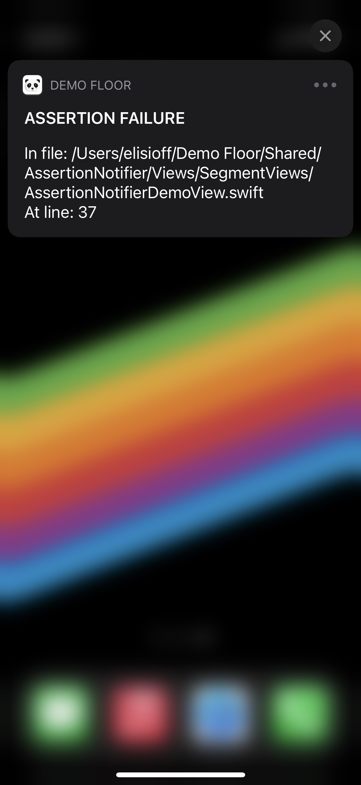

# AssertionNotifier

[](https://travis-ci.com/github/elisioff/AssertionNotifier)
[](https://cocoapods.org/pods/AssertionNotifier)
[](https://cocoapods.org/pods/AssertionNotifier)
[](https://cocoapods.org/pods/AssertionNotifier)


Before a release we may have _debug_, _in-house_, _release-candidate_, etc, builds of our apps. In these builds we often leverage `assertionFailure(:)` which is great as it allows us to timely find and fix issues, the problem is when the assertion is hit and we have no idea what caused the crash because we **are not connected to Xcode**, hence AssertionNotifier.

## What it is
**AssertionNotifier** is a lightweight `struct` that evaluates conditions and reacts to the result. 

It wraps the condition for failure, evaluates it and in case of failure, before terminating the app, schedules a notification to be sent with the information of the **file** and **line** where the issue originated.

It allows you to readily have an idea of the reason for the crash instead of having to look through you favorite crash reporting tool.

### Requirements
- iOS 13
- _10.14 (soon)_

## Installation
AssertionNotifier is available through [CocoaPods](https://cocoapods.org). To install
it, simply add the following line to your Podfile:

```ruby
pod 'AssertionNotifier'
```

## Usage
Make sure you have an entity responsible for handling notifications, for demonstration purposes let's call it `NotificationsHandler`

Have your `NotificationsHandler` conform to the protocol `AssertionMessenger`, as this will provide you with relevant information regarding the origin of your crash when `sendAssertNotification(message:delay:file:line:)` is called.

```swift
protocol AssertionMessenger: AnyObject {

    func sendAssertNotification(message: String,
                                delay: TimeInterval,
                                file: StaticString,
                                line: UInt)
}
```
Be sure to configure `AssertionNotifier` with a reference to your `NotificationsHandler` instance otherwise it won't be able to communicate outside it's scope.

```swift
let assertionNotifierConfig = AssertionNotifier.Config(notificationsHandler: NotificationsHandler.shared)
AssertionNotifier.shared.configure(with: assertionNotifierConfig)
````
Take the information you want and create your notification. 

```swift
extension NotificationsHandler: AssertionMessenger {

    func sendAssertNotification(message: String,
                                delay: TimeInterval,
                                file: StaticString = #file,
                                line: UInt = #line) {

        // 1
        let notificationContent = UNMutableNotificationContent()
        // 2
        notificationContent.title = "Assertion Failure".uppercased()
        notificationContent.subtitle = message
        notificationContent.body = """
                    \(message)
                    In file: \(file)
                    At line: \(line)
                    """
        // 3
        let notificationTrigger = UNTimeIntervalNotificationTrigger(timeInterval: delay,
                                                                    repeats: false)
        // 4
        let notificationRequest = UNNotificationRequest(identifier: "assertionFailureHit",
                                                        content: notificationContent,
                                                        trigger: notificationTrigger)
        // 5
        UNUserNotificationCenter.current().add(notificationRequest)
    }
}
```
Numbers above explained:
1. Create a `UNMutableNotificationContent` object
2. Define a title, subtitle and a body
3. Create a `UNTimeIntervalNotificationTrigger` and set it with the preferred delay you just received
4. Create a `UNNotificationRequest`
5. Add it to the Notification center.

Then all you need it to call `AssertionNotifier` instead of a regular `assert`.

```swift
AssertionNotifier.assert(/*condition*/)
```
Now whenever you hit an assert you will then receive a notification a few seconds later with information that hopefully will save you much time.

### Result Example

|Notification Banner|Notification Detail|
|-|-|
|||
---
**Author** _Elísio Fernandes_

## License
AssertionNotifier is available under the MIT license. See the LICENSE file for more info.
